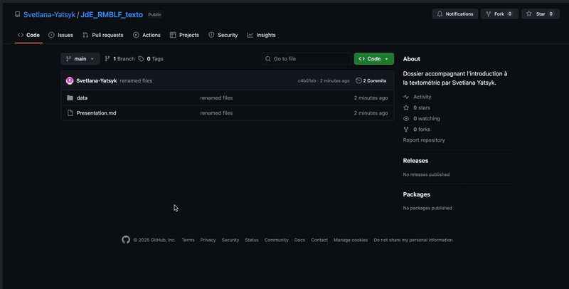
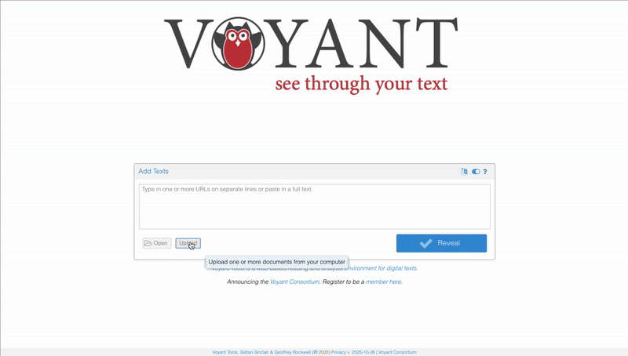

# Introduction

Svetlana Yatsyk, PhD
Ingénieure de recherche à l’IRHT
Projet HORAE

---
# Aujourd’hui, nous allons :
 

- Voir comment aborder un texte par des méthodes quantitatives ;
- Parler de la constitution d’un corpus de manière à rendre votre étude représentative ;
- Apprendre à préparer les textes pour l’analyse ;
- Et enfin, mettre en pratique toutes ces étapes.

---
# La textométrie 
 

- 1949, Roberto Busa, «Index Thomisticus». 179 œuvres de Thomas d’Aquin >10 millions de mots lemmatisés.
- 1960s, Charles Muller, Corneille.
- 1973, Jean-Paul Benzécri, analyse factorielle des correspondances.
- 1970s - nj, Étienne Brunet, pionnier de la statistique textuelle française, concepteur du logiciel Hyperbase. 

---
# Questions pour l’analyse statistique :
 

- Quels mots apparaissent particulièrement souvent dans certain texte ou corpus ?
- La fréquence d’un mot donné varie-t-elle d’un texte à l’autre, ou d’une période à l’autre ?
- Le contexte dans lequel ce mot est employé change-t-il ? Quels sont ses collocations et ses corrélats ?
- Quels mots sont des hapax, c’est-à-dire extrêmement rares ?
- Quelle est la richesse lexicale de l’auteur ou du texte étudié ?

---
# Vulgata Clementina
 

https://github.com/Svetlana-Yatsyk/JdE_RMBLF_texto
 

---
# Voyant Tools
 

https://voyant-tools.org/
 

Pour l’installation locale, suivez [ces consignes](https://github.com/sgsinclair/VoyantServer/wiki/VoyantServer-Desktop).
 

---
# Types et tokens :  définitions
 

Les _tokens_ sont des instances individuelles de mots.
Les _types_ sont les mots uniques.

«Mon chat dort sur le tapis, ton chat dort à côté» → 11 tokens, 9 types.

$$
\text{Richesse lexicale} = \dfrac{\text{types}}{\text{tokens}} = TTR
$$

---
# Qu’est-ce qu’une lemme ?

Une lemme est la _forme canonique_, de base, ou de dictionnaire du mot.
	 	 	 	
La lemmatisation est un processus linguistique qui consiste à **ramener un mot à sa forme de base**. 

---
# Pourquoi la lemmatisation est-elle nécessaire ?

- Réduction de la dimensionnalité ;
- Facilitation de l'apprentissage automatique ;
- Analyse sémantique plus précise ;
- Universalisation du traitement de texte entre les langues.

---
# Pourquoi l'étiquetage morpho-syntaxique est-il nécessaire ?

- On ne badine pas avec une badine.
- Ma soeur Rose arrose ma rose rose.
- Une dame dame le café moulu.
...

---
# Lemmatisation

# Quelques outils en ligne
 

## UDPipe

https://lindat.mff.cuni.cz/services/udpipe/

 

## Deucalion
https://dh.chartes.psl.eu/deucalion/latin

---
# Qu’est-ce qu’un corpus ?
 

Un corpus est un ensemble structuré de textes collectés selon des critères précis, pour servir de base à des études linguistiques, lexicographiques ou pour le traitement automatique des langues.

---
# Critères de constitution
 

- *Représentativité* : le corpus doit refléter fidèlement l’usage du domaine spécifique qu’il prétend représenter;
- *Annotation* : selon les objectifs de recherche, le corpus peut être annoté pour inclure des informations supplémentaires (catégories grammaticales, structures syntaxiques, etc);
- *Homogénéité et consistance interne* : les éléments du corpus doivent suivre les mêmes principes d’annotation, et donc être enrichis de la même densité d’information;
- *Taille* : la taille du corpus doit être suffisante pour permettre une analyse statistique fiable des phénomènes étudiés.

---
# Pour aller plus loin
 

- [Introduction to Voyant Tools for Text Analysis](https://youtu.be/4jCGLmbLFT0) (en anglais) ;
- [Détecter la réutilisation de texte avec Passim](https://programminghistorian.org/fr/lecons/detecter-la-reutilisation-de-texte-avec-passim) ;
- Da, Nan Z. (2019). [The Computational Case against Computational Literary Studies](http://jonathanstray.com/papers/Computational-Literary-Studies.pdf), dans : *Critical Inquiry* 45, p. 601–639 ;
- Pincemin, Bénédicte (2020). [La textométrie en question](https://shs.hal.science/halshs-02902088v1), dans : *Le Français Moderne - Revue de linguistique Française*, Linguistique et traitements quantitatifs, 88 (1), p. 26–43.
